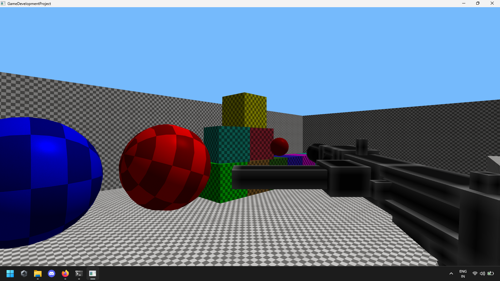

# Fundamental Game Engine

*A fundamental game engine built from scratch in C++ and OpenGL to explore low-level game systems and engine architecture.*

## Features

* Real-time rendering with OpenGL
* Input handling system
* Core game loop implementation
* Basic engine architecture
* Low-level systems programming in C++

## Tech Stack

* C++
* OpenGL
* Visual Studio

## Screenshots

